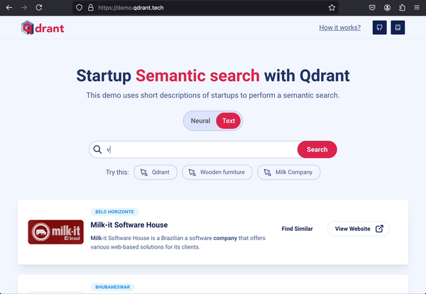

# Semantic Search Engine

You can clone this repo and create your own search engine in a few steps! 
</br> [](https://demo.qdrant.tech/) 

You can use this small app to search through a list of popular startups.
<br> - The **neural search** will read the description and look for similar startups.
</br> - The **keyword search** will look up your exact term in the description. 



## Prerequisites
- Python (v.3.11)
- Docker

## Setup

### 1. Setup the virtual environment 

```python
python -m venv .venv             
source .venv/bin/activate
```

### 2. Install required dependencies

```bash
pip install poetry
poetry install
```

### 3. Download the dataset

```bash
wget https://storage.googleapis.com/generall-shared-data/startups_demo.json -P data/
```

### 4. Deploy the service

```bash
docker-compose -f docker-compose-local.yaml up
```

### 5. Upload data to the application

```bash
python -m qdrant_demo.init_collection_startups
```

### 6.  Go to [http://localhost:8000/](http://localhost:8000/) 


## Using a larger dataset with more startups

You can add a larger dataset of companies provided by [Crunchbase](https://www.crunchbase.com/).

For this, you will need to register at [https://www.crunchbase.com/](https://www.crunchbase.com/) and get an API key.

### 1. Download the data 

```bash
wget 'https://api.crunchbase.com/odm/v4/odm.tar.gz?user_key=<CRUNCHBASE-API-KEY>' -O odm.tar.gz
```

### 2. Decompress the data and add `organizations.csv` to `./data` folder.

```bash
tar -xvf odm.tar.gz
mv odm/organizations.csv ./data
```

### 3. Now you can index new Crunchbase data into Qdrant

```bash
python -m qdrant_demo.init_collection_crunchbase
```
